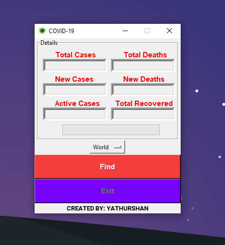

# Covid-19 Case Tracker
A web scraper using python to fetch the latests updates on coronavirus cases and other info from https://www.worldometers.info/coronavirus/

To clone this repository enter the following command in your terminal.

    $ git clone https://github.com/Studiex/Covid-19-Case-Tracker.git

## Example

    $ .\covid_19_case_tracker.py
    

## Reference
Worldometers website - https://www.worldometers.info/coronavirus/
